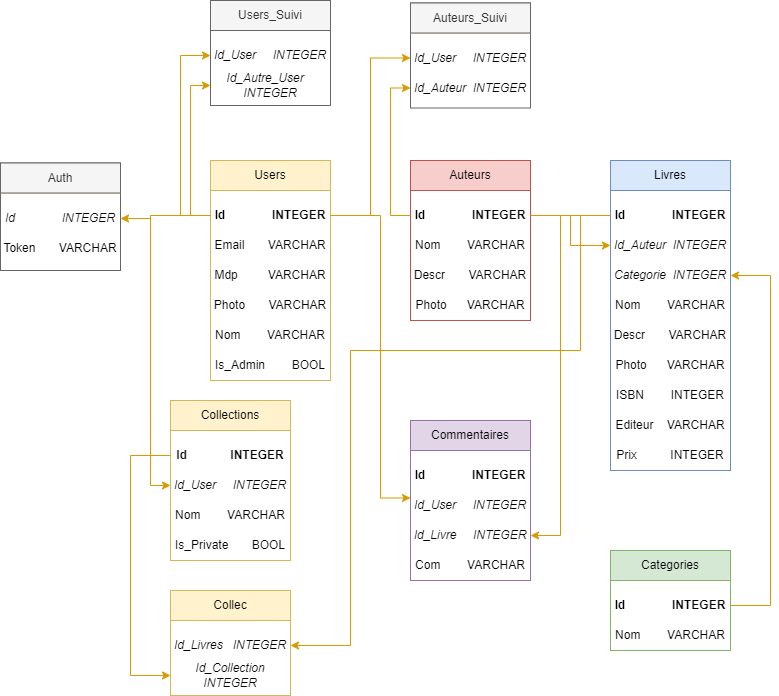

# To do list

- ajouter la catégorie du livre dans le CSV des livres
- formater le str quand je le récupère dans le code de scrapping => enlever les apostrophes (nom, desc, editeur, auteur, categorie, nom_auteur, desc_auteur)
- modifier le MCD en supprimant la table Categories
- modifier le script SQL => suppr table categorie et modif champs categorie dans Livres
- modifier le remplissage de la database en consequence
- recuperer les modif fait dans le repo principale
- modif API pour ajouter l'ajout de collection et le token quand on crée un utilisateur

# BDD Projet Final B2 (avec Patchouf)

Vous trouverez dans ce repo la base de donnée de notre projet de fin de deuxième année.

- Repository principal : [Projet_Final_B2](https://github.com/Yann-Fournier/Projet_Final_B2)

### Ce repo contient : 
- Un code de scrapping des livres d'Amazon (Scrapping/Scrap.py)
- Un script de nettoyage et de formatage des données récupéré avec le scrapping (Scrapping/Clean.py)
- Notre base de donnée (Database.db)
- Un script sql qui permet de créer chacun des tables de notre base de donnée (script.sql)
- Un script python qui rempli la base de donnée avec les données du scrapping (Fill_Database_Biblio.py)

### Schéma de notre base de donnée :

